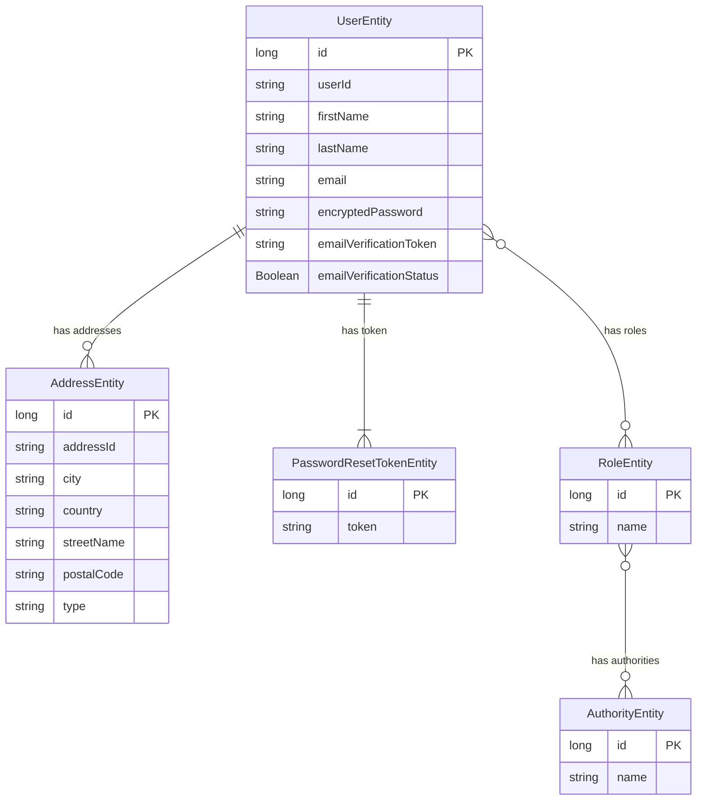

# user_service_apps

```mermaid
erDiagram
direction TB

    UserEntity ||--o{ AddressEntity : "has addresses"
    UserEntity ||--|{ PasswordResetTokenEntity : "has token"
    UserEntity }o--o{ RoleEntity : "has roles"
    RoleEntity }o--o{ AuthorityEntity : "has authorities"

    UserEntity {
        long id PK
        string userId
        string firstName
        string lastName
        string email
        string encryptedPassword
        string emailVerificationToken
        Boolean emailVerificationStatus
    }

    AddressEntity {
        long id PK
        string addressId
        string city
        string country
        string streetName
        string postalCode
        string type
    }

    RoleEntity {
        long id PK
        string name
    }

    AuthorityEntity {
        long id PK
        string name
    }

    PasswordResetTokenEntity {
        long id PK
        string token
    }
```