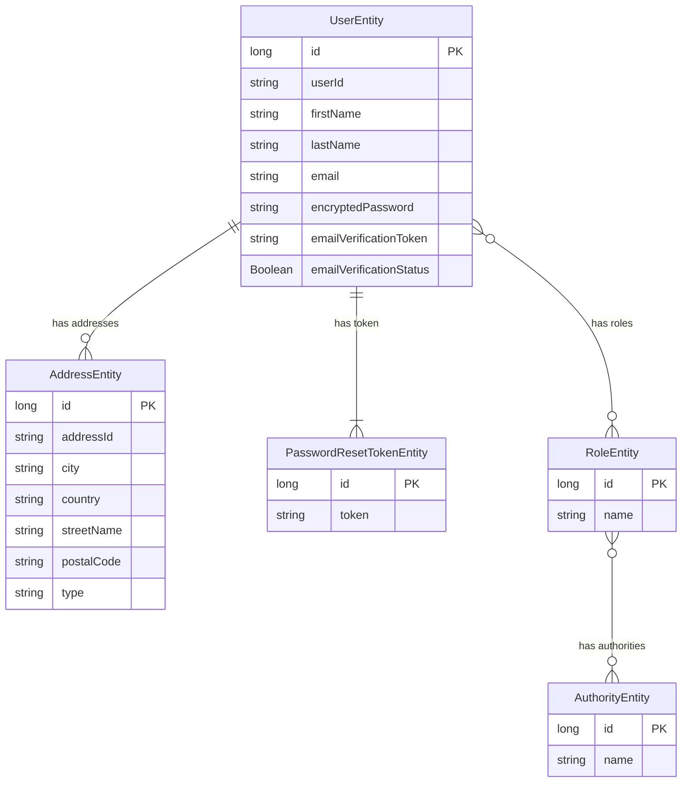

# user_service_apps

# E-commerce web service
# Use a professional style with clear labeled components, minimal colors, and cloud-native design.**

```
**Include the following layers and components:**

**1. Client Layer:**

** - Web Browser (React.js)**

** - Mobile App (React Native)**

**2. API Gateway:**

** - Routing**

** - Authentication & Rate Limiting**

**3. Microservices Layer:**

** - User Service (Signup, Login, Profile)**

** - Product Service (Catalog, Search, Inventory)**

** - Order Service (Cart, Checkout, Payments)**

** - Payment Service (Stripe/PayPal Integration)**

** - Notification Service (Email/SMS)**

** - Review & Ratings Service**

** - Analytics Service**

**4. Databases:**

** - User DB (RDS/PostgreSQL)**

** - Product DB (NoSQL – DynamoDB or MongoDB)**

** - Order DB (SQL – MySQL/PostgreSQL)**

** - Cache Layer (Redis)**

**5. External Integrations:**

** - Payment Gateway (Stripe/PayPal)**

** - Email Provider (SES, SendGrid)**

** - SMS Provider (Twilio)**

**6. Infrastructure:**

** - Load Balancer**

** - API Gateway**

** - Container Orchestration (Kubernetes/ECS)**

** - Service Mesh (Optional)**

** - Message Queue (Kafka/SQS)**

** - CDN for static assets**

** - Object Storage (AWS S3) for images**

**7. Security Layer:**

** - IAM Roles**

** - JWT Authentication**

** - WAF Firewall**

** - Encryption (KMS)**

**8. Monitoring & Logging:**

** - CloudWatch / Prometheus / ELK**

** - Centralized Log Storage**

```


