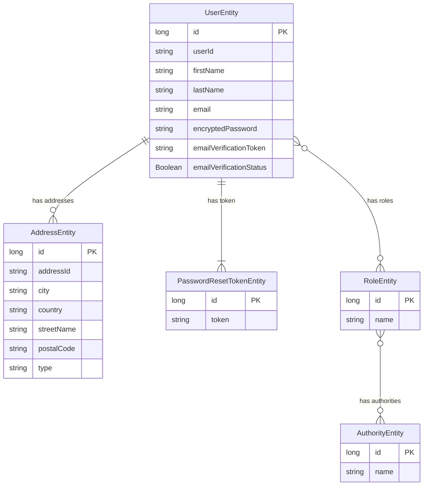

# user_service_apps

# E-commerce web service
# Use a professional style with clear labeled components, minimal colors, and cloud-native design.**

flowchart TB

%% =========================
%% Client Layer
%% =========================
subgraph Client_Layer["Client Layer"]
Web[Web Browser (React.js)]
Mobile[Mobile App (React Native)]
end

%% =========================
%% Edge & Access Layer
%% =========================
subgraph Edge_Layer["Edge & Access Layer"]
CDN[CDN - Static Assets]
LB[Load Balancer]
APIGW[API Gateway - Routing, Auth, Rate Limiting]
WAF[WAF Firewall]
end

%% =========================
%% Microservices Layer
%% =========================
subgraph Microservices["Microservices Layer"]
UserSvc[User Service - Signup, Login, Profile]
ProductSvc[Product Service - Catalog, Search, Inventory]
OrderSvc[Order Service - Cart, Checkout, Payments]
PaymentSvc[Payment Service - Stripe / PayPal]
NotifySvc[Notification Service - Email, SMS]
ReviewSvc[Review & Ratings Service]
AnalyticsSvc[Analytics Service]
end

%% =========================
%% Data Layer
%% =========================
subgraph Data_Layer["Data Layer"]
UserDB[(User DB - PostgreSQL / RDS)]
ProductDB[(Product DB - NoSQL)]
OrderDB[(Order DB - MySQL / PostgreSQL)]
Cache[(Cache - Redis)]
ObjectStore[(Object Storage - AWS S3)]
end

%% =========================
%% Messaging Layer
%% =========================
subgraph Messaging["Messaging Layer"]
MQ[Message Queue - Kafka / SQS]
end

%% =========================
%% External Integrations
%% =========================
subgraph External["External Integrations"]
Stripe[Payment Gateway - Stripe / PayPal]
Email[Email Provider - SES / SendGrid]
SMS[SMS Provider - Twilio]
end

%% =========================
%% Infrastructure
%% =========================
subgraph Infra["Infrastructure"]
K8s[Container Orchestration - Kubernetes / ECS]
Mesh[Service Mesh - Optional]
IAM[IAM Roles]
KMS[Encryption - KMS]
end

%% =========================
%% Monitoring & Logging
%% =========================
subgraph Observability["Monitoring & Logging"]
Metrics[CloudWatch / Prometheus]
Logs[Centralized Logs - ELK Stack]
end

%% =========================
%% Connections
%% =========================
Web --> CDN --> LB
Mobile --> LB
LB --> WAF --> APIGW

APIGW --> UserSvc
APIGW --> ProductSvc
APIGW --> OrderSvc
APIGW --> ReviewSvc
APIGW --> AnalyticsSvc

OrderSvc --> PaymentSvc
OrderSvc --> MQ
MQ --> NotifySvc

UserSvc --> UserDB
ProductSvc --> ProductDB
OrderSvc --> OrderDB

UserSvc --> Cache
ProductSvc --> Cache
OrderSvc --> Cache

ProductSvc --> ObjectStore

PaymentSvc --> Stripe
NotifySvc --> Email
NotifySvc --> SMS

APIGW --> IAM
K8s --> IAM
Data_Layer --> KMS

UserSvc -.-> Metrics
ProductSvc -.-> Metrics
OrderSvc -.-> Metrics
PaymentSvc -.-> Logs

