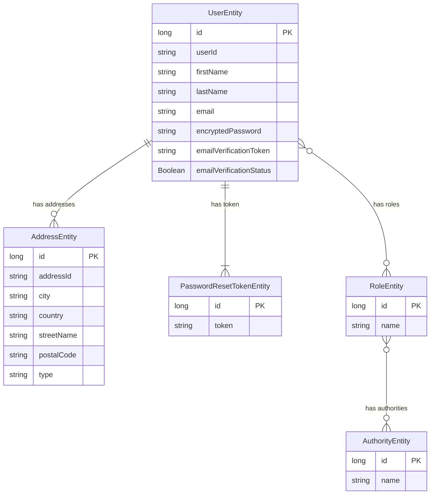

# user_service_apps

# E-commerce web service
# Use a professional style with clear labeled components, minimal colors, and cloud-native design.**

```mermaid
flowchart TB
    %% =========================
    %% Client Layer
    %% =========================
    subgraph Client_Layer["Client Layer"]
        Web[Web Browser\n(React.js)]
        Mobile[Mobile App\n(React Native)]
    end

    %% =========================
    %% Edge & Access
    %% =========================
    subgraph Edge_Layer["Edge & Access Layer"]
        CDN[CDN\nStatic Assets]
        LB[Load Balancer]
        APIGW[API Gateway\nRouting • Auth • Rate Limiting]
        WAF[WAF Firewall]
    end

    %% =========================
    %% Microservices Layer
    %% =========================
    subgraph Microservices["Microservices Layer"]
        UserSvc[User Service\nSignup • Login • Profile]
        ProductSvc[Product Service\nCatalog • Search • Inventory]
        OrderSvc[Order Service\nCart • Checkout • Payments]
        PaymentSvc[Payment Service\nStripe / PayPal]
        NotifySvc[Notification Service\nEmail • SMS]
        ReviewSvc[Review & Ratings Service]
        AnalyticsSvc[Analytics Service]
    end

    %% =========================
    %% Data Layer
    %% =========================
    subgraph Data_Layer["Data Layer"]
        UserDB[(User DB\nPostgreSQL / RDS)]
        ProductDB[(Product DB\nNoSQL)]
        OrderDB[(Order DB\nMySQL / PostgreSQL)]
        Cache[(Cache\nRedis)]
        ObjectStore[(Object Storage\nAWS S3)]
    end

    %% =========================
    %% Messaging
    %% =========================
    subgraph Messaging["Messaging Layer"]
        MQ[Message Queue\nKafka / SQS]
    end

    %% =========================
    %% External Integrations
    %% =========================
    subgraph External["External Integrations"]
        Stripe[Payment Gateway\nStripe / PayPal]
        Email[Email Provider\nSES / SendGrid]
        SMS[SMS Provider\nTwilio]
    end

    %% =========================
    %% Infrastructure
    %% =========================
    subgraph Infra["Infrastructure"]
        K8s[Container Orchestration\nKubernetes / ECS]
        Mesh[Service Mesh\n(Optional)]
        IAM[IAM Roles]
        KMS[Encryption\nKMS]
    end

    %% =========================
    %% Monitoring & Logging
    %% =========================
    subgraph Observability["Monitoring & Logging"]
        Metrics[CloudWatch / Prometheus]
        Logs[Centralized Logs\nELK Stack]
    end

    %% =========================
    %% Connections
    %% =========================
    Web --> CDN --> LB
    Mobile --> LB
    LB --> WAF --> APIGW

    APIGW --> UserSvc
    APIGW --> ProductSvc
    APIGW --> OrderSvc
    APIGW --> ReviewSvc
    APIGW --> AnalyticsSvc

    OrderSvc --> PaymentSvc
    OrderSvc --> MQ
    MQ --> NotifySvc

    UserSvc --> UserDB
    ProductSvc --> ProductDB
    OrderSvc --> OrderDB

    UserSvc --> Cache
    ProductSvc --> Cache
    OrderSvc --> Cache

    ProductSvc --> ObjectStore

    PaymentSvc --> Stripe
    NotifySvc --> Email
    NotifySvc --> SMS

    UserSvc -.-> Metrics
    ProductSvc -.-> Metrics
    OrderSvc -.-> Metrics
    PaymentSvc -.-> Logs

    APIGW --> IAM
    K8s --> IAM
    Data_Layer --> KMS
```
