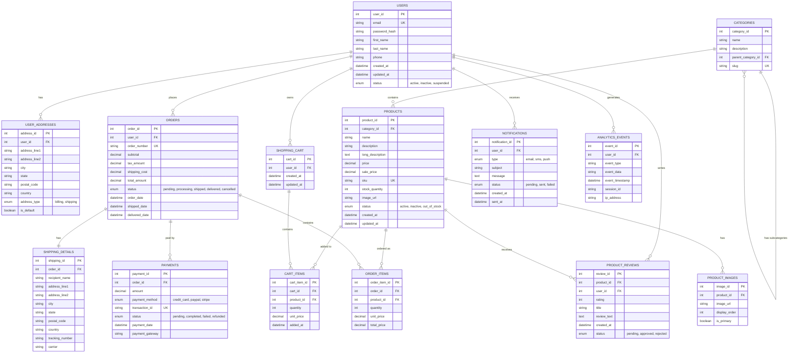
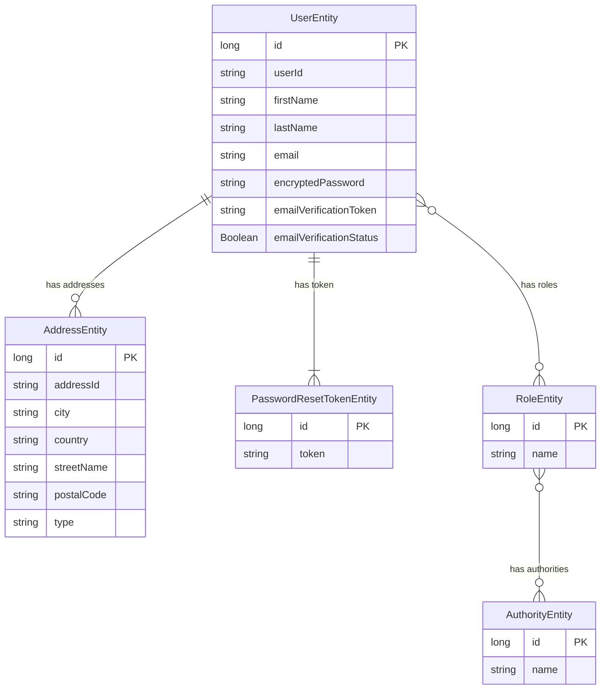

# user_service_apps

# E-commerce web service
# Use a professional style with clear labeled components, minimal colors, and cloud-native design.**

```mermaid
erDiagram
    %% User Management
    USERS {
        int user_id PK
        string email UK
        string password_hash
        string first_name
        string last_name
        string phone
        datetime created_at
        datetime updated_at
        enum status "active, inactive, suspended"
    }

    USER_ADDRESSES {
        int address_id PK
        int user_id FK
        string address_line1
        string address_line2
        string city
        string state
        string postal_code
        string country
        enum address_type "billing, shipping"
        boolean is_default
    }

    %% Product Catalog
    CATEGORIES {
        int category_id PK
        string name
        string description
        int parent_category_id FK
        string slug UK
    }

    PRODUCTS {
        int product_id PK
        int category_id FK
        string name
        string description
        text long_description
        decimal price
        decimal sale_price
        string sku UK
        int stock_quantity
        string image_url
        enum status "active, inactive, out_of_stock"
        datetime created_at
        datetime updated_at
    }

    PRODUCT_IMAGES {
        int image_id PK
        int product_id FK
        string image_url
        int display_order
        boolean is_primary
    }

    PRODUCT_REVIEWS {
        int review_id PK
        int product_id FK
        int user_id FK
        int rating
        string title
        text review_text
        datetime created_at
        enum status "pending, approved, rejected"
    }

    %% Shopping & Orders
    SHOPPING_CART {
        int cart_id PK
        int user_id FK
        datetime created_at
        datetime updated_at
    }

    CART_ITEMS {
        int cart_item_id PK
        int cart_id FK
        int product_id FK
        int quantity
        decimal unit_price
        datetime added_at
    }

    ORDERS {
        int order_id PK
        int user_id FK
        string order_number UK
        decimal subtotal
        decimal tax_amount
        decimal shipping_cost
        decimal total_amount
        enum status "pending, processing, shipped, delivered, cancelled"
        datetime order_date
        datetime shipped_date
        datetime delivered_date
    }

    ORDER_ITEMS {
        int order_item_id PK
        int order_id FK
        int product_id FK
        int quantity
        decimal unit_price
        decimal total_price
    }

    SHIPPING_DETAILS {
        int shipping_id PK
        int order_id FK
        string recipient_name
        string address_line1
        string address_line2
        string city
        string state
        string postal_code
        string country
        string tracking_number
        string carrier
    }

    %% Payments
    PAYMENTS {
        int payment_id PK
        int order_id FK
        decimal amount
        enum payment_method "credit_card, paypal, stripe"
        string transaction_id UK
        enum status "pending, completed, failed, refunded"
        datetime payment_date
        string payment_gateway
    }

    %% Notifications
    NOTIFICATIONS {
        int notification_id PK
        int user_id FK
        enum type "email, sms, push"
        string subject
        text message
        enum status "pending, sent, failed"
        datetime created_at
        datetime sent_at
    }

    %% Analytics
    ANALYTICS_EVENTS {
        int event_id PK
        int user_id FK
        string event_type
        string event_data
        datetime event_timestamp
        string session_id
        string ip_address
    }

    %% Relationships
    USERS ||--o{ USER_ADDRESSES : has
    USERS ||--o{ SHOPPING_CART : owns
    USERS ||--o{ ORDERS : places
    USERS ||--o{ PRODUCT_REVIEWS : writes
    USERS ||--o{ NOTIFICATIONS : receives
    USERS ||--o{ ANALYTICS_EVENTS : generates

    CATEGORIES ||--o{ CATEGORIES : "has subcategories"
    CATEGORIES ||--o{ PRODUCTS : contains

    PRODUCTS ||--o{ PRODUCT_IMAGES : has
    PRODUCTS ||--o{ PRODUCT_REVIEWS : receives
    PRODUCTS ||--o{ CART_ITEMS : "added to"
    PRODUCTS ||--o{ ORDER_ITEMS : "ordered as"

    SHOPPING_CART ||--o{ CART_ITEMS : contains

    ORDERS ||--o{ ORDER_ITEMS : contains
    ORDERS ||--|| SHIPPING_DETAILS : has
    ORDERS ||--o{ PAYMENTS : "paid by"

```

```mermaid
erDiagram
direction TB

    UserEntity ||--o{ AddressEntity : "has addresses"
    UserEntity ||--|{ PasswordResetTokenEntity : "has token"
    UserEntity }o--o{ RoleEntity : "has roles"
    RoleEntity }o--o{ AuthorityEntity : "has authorities"

    UserEntity {
        long id PK
        string userId
        string firstName
        string lastName
        string email
        string encryptedPassword
        string emailVerificationToken
        Boolean emailVerificationStatus
    }

    AddressEntity {
        long id PK
        string addressId
        string city
        string country
        string streetName
        string postalCode
        string type
    }

    RoleEntity {
        long id PK
        string name
    }

    AuthorityEntity {
        long id PK
        string name
    }

    PasswordResetTokenEntity {
        long id PK
        string token
    }
```